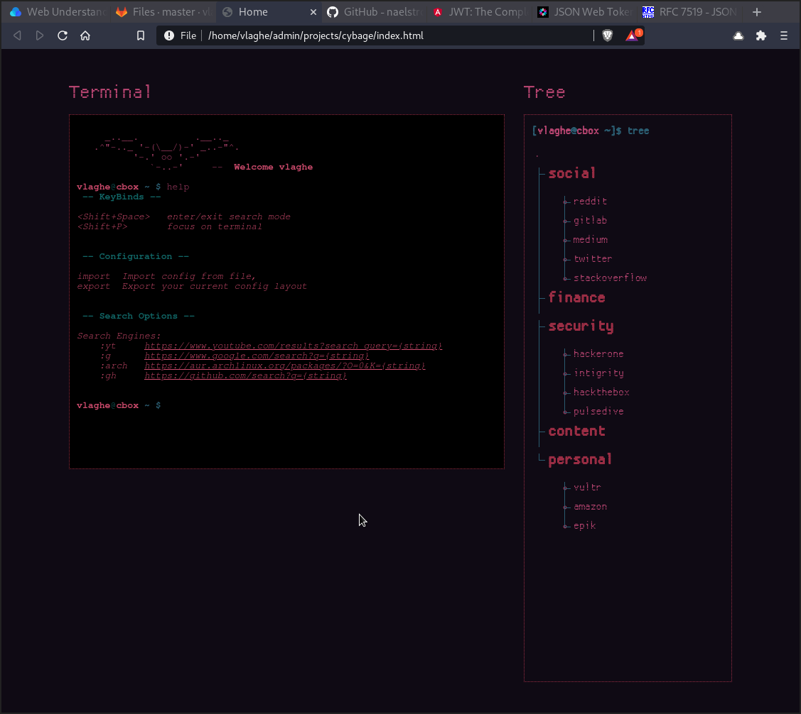

# CyBage
This is my personal browser home page. It acts as a submodule for [The Cyber Box](https://gitlab.com/vlaghe/cbox) repository.



[[_TOC_]]


## Functionalities

Currently it has 3 main components:
1. The link navigation tree, which acts as a quick way of reaching commonly used websited. 
2. The terminal, which is built with the [JQuery Terminal Plugin](https://terminal.jcubic.pl/). Currently the only functionality it has is to import/export your config and display the help msg. However, you can do a lot of peculiar stuff with it, so expect more options in the future.
3. The search, which lets you use *search engines* for a quicker way of searching

All of the above can be configured by your preference. For more info see the [Configuration](#configuration) section below.

## Installation
If you're using the `Cybage` alongside with my dotfiles, everything is taken care for you automatically.

However, if you want to use this repo separately, just clone it:
```bash
git clone "https://gitlab.com/vlaghe/cybage.git"
```
And change your default home-page in your browser of preference to the `index.html` file.
If you don't know how to do that, just [duck it](https://duckduckgo.com/?q=change+default+browser+home+page&ia=web).

## Configuration
The default configuration is set to my preferences *(config.json)*, however you can create your custom configuration by importing a *JSON* file, using the terminal's `import` command, in the following format:
```json

{
 "name": "your_name",
 "hostname": "your_host",
 "search_engines": {
	"<engine_shortcut>": "<url>",
	...
 },
 "structure": {
	"<categ_name>": [
		["name", "url"]
		...
	],
	...
 }
}

```

**Example configuration**
```json
{
 "name": "vlaghe",
 "hostname": "cbox",
 "search_engines": {
	":g": "https://www.google.com/search?q="
 },
 "structure": {
	"fun": [
		["reddit", "https://reddit.com/login"],
		["hackernoon", "https://hackernoon.com/"]
	]
 }
}
```
In order to export your configuration just run `export` in the terminal.

## Contribution & Support
### TODO's
- [X] Search engines within search mode
- [ ] Dynamic color scheme from config file
- [ ] Terminal integration
  - [X] config (import/export)
  - [ ] add new search engine from terminal

Widgets
- [ ] Recently closed 
- [ ] Crypto 
- [ ] Weather 
- [ ] Clock 
- [ ] CTF-Time 
